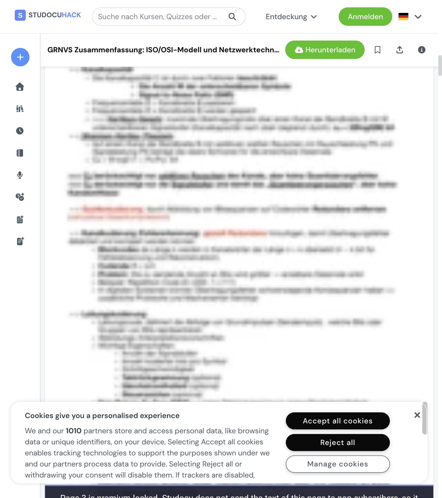

<p align="center">
  
</p>

# StudocuHack

A browser extension for [studocu.com](https://www.studocu.com), [studeersnel.nl](https://www.studeersnel.nl), [studocu.vn](https://www.studocu.vn) and [studocu.id](https://www.studocu.id) that removes the premium blur and upsell chrome from documents and lets you download them as a complete PDF.

Works in Chrome, Brave, Edge and Firefox 142 or newer (Manifest V3). No account, no server, no data collection.

## What it does

- Removes the blur from every page whose content Studocu actually sends to your browser.
- Removes the premium banners, badges, "Upgrade" buttons and the modal that covers the document.
- Adds a Download button that captures every page (text and figures) and prints the whole document to PDF.
- Loads all pages on open so you do not have to scroll through the document to render it.
- Hides ads (Refinery89, Google Publisher Tag, Adagio) and the "Ask a question" AI toolbar.
- Each of the extras can be switched off from the toolbar popup.

## What it cannot do

Studocu renders a native PDF as two separate layers per page: a background image holding the figures (rules, table borders, coloured boxes) and a separate HTML text layer holding the words. The two are authorised separately, and on premium documents Studocu never sends the text layer of the locked pages to the browser at all. No extension can un-blur those pages, because the words are not on your computer in any form.

Pages in that state keep Studocu's blurred preview and are labelled "premium-locked", in the viewer and in the download, so you can tell them apart from a page that failed to load. Every page whose text Studocu does send is unlocked in full. The browser console lists exactly which pages could not be recovered.

<p align="center">
  
</p>

The details are in [docs/ARCHITECTURE.md](docs/ARCHITECTURE.md).

## Install

Download the latest archive from the [Releases page](https://github.com/danieltyukov/studocuhack/releases). Each release ships a `.zip` for Chromium browsers and an `.xpi` for Firefox.

### Chrome, Brave, Edge

1. Download `studocuhack-vX.Y.Z.zip` and extract it somewhere you will keep it.
2. Open `chrome://extensions` (Brave: `brave://extensions`, Edge: `edge://extensions`).
3. Turn on **Developer mode** (top right).
4. Click **Load unpacked** and select the extracted folder (the one containing `manifest.json`).

To update, download the new zip, extract it over the old folder, and press the reload icon on the extension card.


### Firefox

1. Download `studocuhack-vX.Y.Z.xpi`.
2. Open `about:addons`, click the gear icon, choose **Install Add-on From File...** and select the `.xpi`.
3. Open a Studocu document, click the puzzle icon in the toolbar, open the extension's settings and choose **Always Allow on studocu.com** (and on studeersnel.nl, studocu.vn or studocu.id if you use them).

Release builds of Firefox only install add-ons that Mozilla has signed. The `.xpi` attached to a release is signed; if you build your own from source you need Firefox Developer Edition or Nightly with `xpinstall.signatures.required` set to `false`, or run it temporarily through `about:debugging`.


## Usage

### Downloading a document

1. Open the document and click the blue **Download** button above the pages.
2. A preview opens in the same tab and captures every page automatically. You will see "Capturing pages X / N" and then "Embedding images X / N". Keep the tab in the foreground: a background tab is throttled by the browser and the capture stalls.
3. When it finishes, click **Print / Save as PDF** (or press Ctrl+P / Cmd+P) and choose **Save as PDF** as the destination.

Press Esc or click **Close** to leave the preview.

### Settings

Click the extension icon in the toolbar to open the settings popup. You can switch off the download button, the automatic page loading, ad hiding, the AI toolbar hiding and the logo replacement. Blur removal is always on. Changes apply the next time a document page loads.

## How it works, briefly

Studocu's viewer is [pdf2htmlEX](https://github.com/pdf2htmlEX/pdf2htmlEX) output wrapped in a React virtual scroller. Each page is a background image plus a positioned HTML text layer, both fetched from a CDN with signed URLs that are embedded in the page. The extension reads those signed parameters, works out which pages the server will actually serve, fetches the full-resolution assets for those, and labels the rest. The blur itself is a CSS filter the extension strips and keeps stripped as React re-renders.

The full write-up, including the CDN layout and the reasoning behind the premium-locked detection, is in [docs/ARCHITECTURE.md](docs/ARCHITECTURE.md).

## Development

```
git clone https://github.com/danieltyukov/studocuhack.git
cd studocuhack
npm install
npm test          # unit and fixture tests (node --test + jsdom)
npm run lint      # web-ext lint on src/
npm run build     # dist/studocuhack-vX.Y.Z.{zip,xpi}
```

Load `src/` as an unpacked extension to run the working copy directly, or use `npm run start:firefox` / `npm run start:chromium` to launch a browser with it through web-ext.

The layout:

```
src/                the extension (this is what gets packaged)
  manifest.json
  content/          content scripts, loaded in this order:
    common.js         shared namespace: selectors, access model, settings
    cleanup.js        banners, badges, native buttons, logo
    pages.js          blur removal, page loading, premium-locked detection
    download.js       download overlay
    main.js           observers and timers that drive the above
    style.css         applied before the scripts run
  popup/            toolbar popup (settings)
test/               node --test suites with jsdom fixtures
scripts/            build and Firefox signing
docs/               architecture notes and screenshots
```

See [CONTRIBUTING.md](CONTRIBUTING.md) for how to report a broken selector, add a fix, and how releases are cut.

## Reporting problems

Open an [issue](https://github.com/danieltyukov/studocuhack/issues/new/choose). The bug template asks for your browser, the extension version, the kind of document and the lines starting with `StudocuHack:` from the browser console. Those lines say exactly which pages the extension could and could not recover, which is usually the whole diagnosis.

Studocu changes its CSS class names from time to time. When a banner or the blur comes back after a site update, the fix is almost always a new selector in `src/content/common.js` and `src/content/style.css`; pull requests for those are very welcome.

## License and disclaimer

MIT, see [LICENSE](LICENSE).

This project is not affiliated with or endorsed by Studocu. It is published for educational purposes; you are responsible for complying with the terms of service of any site you use it on.
